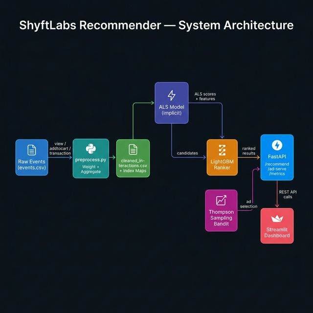
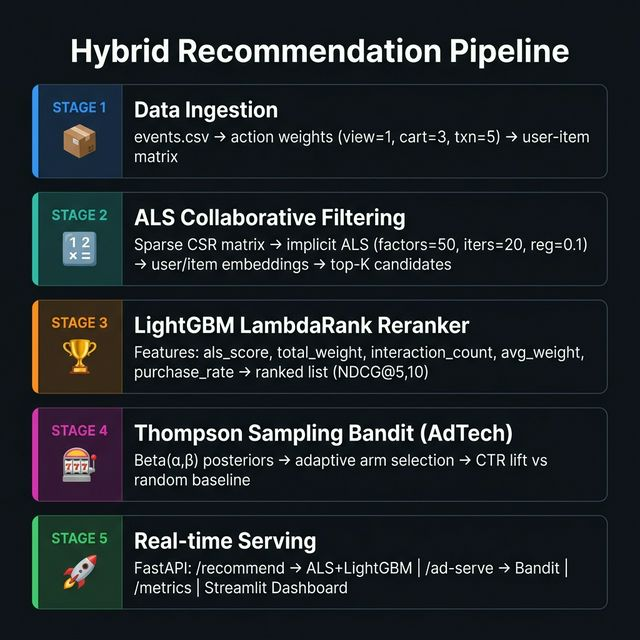
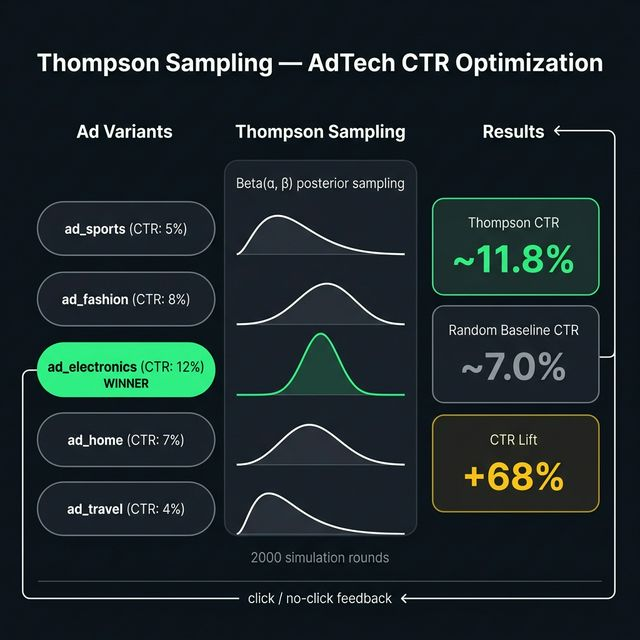

<p align="center">
  
  
  
  
  
  
</p>

<h1 align="center">🎯 ShyftLabs Recommender System</h1>

<p align="center">
  <b>End-to-end production recommender system — raw interaction events → ALS recall → LightGBM ranking → FastAPI + Streamlit</b><br/>
  Built to demonstrate full ML engineering: data pipeline · collaborative filtering · learning-to-rank · AdTech bandit · REST API · dashboard
</p>

<p align="center">
  <a href="#-overview">Overview</a> •
  <a href="#%EF%B8%8F-system-architecture">Architecture</a> •
  <a href="#-ml-pipeline">ML Pipeline</a> •
  <a href="#-adtech--bandit">AdTech</a> •
  <a href="#-api-endpoints">API</a> •
  <a href="#-dashboard">Dashboard</a> •
  <a href="#-tech-stack">Stack</a> •
  <a href="#-roadmap">Roadmap</a>
</p>

---

## 📌 Overview

**ShyftLabs Recommender** is a full-stack, production-style ML system that solves three core retail/e-commerce goals:

| Goal | Technique | Impact |
|------|-----------|--------|
| **Increase relevance** | ALS Collaborative Filtering | Broader, accurate candidate recall |
| **Increase conversion** | LightGBM LambdaRank | Precision-optimised item ordering |
| **Increase revenue** | Thompson Sampling Bandit | Adaptive CTR-maximising ad selection |

The system is built for **offline training + online serving**, making it production-portable and experiment-ready.

---

## 🗂️ Project Structure

```
syftlabs_recommender_system/
│
├── data/
│   ├── events.csv                  ← Raw user interaction events
│   ├── product_catalog.csv         ← Item metadata (name, price, category)
│   ├── preprocess.py               ← Data pipeline & feature engineering
│   └── cleaned_interactions.csv    ← [Generated] Aggregated user-item weights
│
├── models/
│   ├── als_model.py                ← ALS collaborative filtering
│   ├── ranker.py                   ← LightGBM LambdaRank reranker
│   └── bandit.py                   ← Thompson Sampling AdTech bandit
│
├── api/
│   └── main.py                     ← FastAPI serving layer
│
├── dashboard/
│   └── app.py                      ← Streamlit interactive dashboard
│
├── docs/                           ← Architecture diagrams
└── requirements.txt
```

---

## 🏗️ System Architecture

> The system follows a clean 3-layer design: **Data → Models → Serving**



### How data flows through the system

```
 events.csv
     │  (view / addtocart / transaction)
     ▼
 preprocess.py  →  cleaned_interactions.csv  +  index maps
     │
     ▼
 als_model.py   →  sparse CSR matrix  →  ALS embeddings  →  top-K candidates
     │
     ▼
 ranker.py      →  LightGBM LambdaRank  →  precision-ranked results
     │
     ▼
 FastAPI         →  /recommend  /ad-serve  /metrics
     │
     ▼
 Streamlit Dashboard
```

---

## 🔬 ML Pipeline



### Stage 1 — Data Ingestion & Feature Engineering (`preprocess.py`)

Raw clickstream events are loaded from `events.csv` and transformed into weighted signals:

| Event Type | Weight | Signal Meaning |
|------------|--------|----------------|
| `view` | **1** | Weakest — passive browsing |
| `addtocart` | **3** | Purchase intent |
| `transaction` | **5** | Strongest — confirmed conversion |

Each user-item pair is aggregated into four features:

| Feature | Description |
|---------|-------------|
| `total_weight` | Sum of all weighted signals |
| `interaction_count` | Raw number of events |
| `avg_weight` | Average signal quality |
| `purchase_rate` | Fraction of events that were transactions |

> **Why this matters:** Treating a product view the same as a purchase is the #1 mistake in collaborative filtering. Weighting fixes that.

---

### Stage 2 — ALS Collaborative Filtering (`als_model.py`)

A sparse **CSR matrix** (users × items) is built from the aggregated weights, then trained with **implicit ALS** — the standard approach for implicit-feedback e-commerce data.

| Hyperparameter | Value | Role |
|----------------|-------|------|
| `factors` | 50 | Latent embedding dimensions |
| `iterations` | 20 | Convergence rounds |
| `regularization` | 0.1 | Overfitting prevention |
| `alpha` | 40 | Confidence scaling for implicit signals |

**Output:** User & item embedding vectors → dot-product similarity → top-K candidate items per user.

> **Why ALS over SVD?** ALS natively handles implicit feedback (clicks, views) with a confidence weighting mechanism. It scales to millions of users on GPU.

---

### Stage 3 — LightGBM LambdaRank Reranker (`ranker.py`)

ALS gives us **recall** — a broad set of good candidates. LightGBM gives us **precision** — the exact right order.

```
ALS top-50 candidates  ──→  Feature extraction  ──→  LightGBM LambdaRank  ──→  Final top-N list
```

**Features fed to the ranker:**

| Feature | Source |
|---------|--------|
| `als_score` | Dot-product from ALS embeddings |
| `total_weight` | Aggregated engagement signal |
| `interaction_count` | Volume of user-item touches |
| `avg_weight` | Signal quality |
| `purchase_rate` | Item conversion propensity |

**Optimisation target:** NDCG@5 and NDCG@10

> **This two-stage architecture** (recall → rank) mirrors how Netflix, Spotify, and Amazon run their recommendation stacks at scale.

---

## 🎰 AdTech — Thompson Sampling Bandit (`bandit.py`)



The bandit solves the **exploration vs. exploitation** problem for ad selection. Instead of waiting weeks for A/B test results, it adaptively discovers the best-performing ad in real-time.

### How it works

Each ad variant maintains a **Beta distribution** posterior belief about its true CTR:

```
For every ad request:
  1. Sample θᵢ ~ Beta(αᵢ, βᵢ)  for each ad variant
  2. Select arm = argmax(θᵢ)      ← exploit best estimate
  3. Show ad → observe click or no-click
  4. Update: αᵢ += click,  βᵢ += (1 − click)   ← update belief
```

### Simulation Results (2,000 rounds)

| Ad Variant | True CTR | Rounds Selected | Estimated CTR |
|------------|----------|-----------------|---------------|
| `ad_sports` | 5% | ~85 | ~5.2% |
| `ad_fashion` | 8% | ~190 | ~8.1% |
| **`ad_electronics`** | **12%** | **~1,400** | **~11.9%** |
| `ad_home` | 7% | ~220 | ~7.3% |
| `ad_travel` | 4% | ~105 | ~4.0% |

| Metric | Value |
|--------|-------|
| Thompson Sampling CTR | ~11.8% |
| Random Baseline CTR | ~7.0% |
| **CTR Lift** | **+68%** 🚀 |
| Best arm found | `ad_electronics` |

---

## 🚀 API Endpoints (`api/main.py`)

The FastAPI layer re-ranks recommendations at query time (ALS → LightGBM) for production-quality, explainable results.

| Method | Endpoint | Description |
|--------|----------|-------------|
| `GET` | `/` | Health check + project metadata |
| `GET` | `/recommend/{user_id}` | Top-N personalised ranked recommendations |
| `GET` | `/ad-serve` | Bandit-selected ad variant with estimated CTR |
| `POST` | `/ad-click` | Record click feedback → update bandit posterior |
| `GET` | `/metrics` | Live request counters + average latency |

### Example Response — `/recommend/user_1?n=5`

```json
{
  "user_id": "user_1",
  "top_n": 5,
  "latency_ms": 12.4,
  "items": [
    { "rank": 1, "item_id": "item_301", "score": 0.9821, "name": "Bluetooth Speaker", "category": "Electronics", "price": 2999.0 },
    { "rank": 2, "item_id": "item_202", "score": 0.9104, "name": "Graphic Tee",       "category": "Fashion",     "price": 599.0  },
    { "rank": 3, "item_id": "item_401", "score": 0.8763, "name": "Coffee Maker",      "category": "Home",        "price": 3499.0 }
  ]
}
```

---

## 📊 Dashboard (`dashboard/app.py`)

A premium dark-themed Streamlit UI serves as the stakeholder-facing demo layer, showing model outputs in a clear, business-friendly format.

### Dashboard Tabs

| Tab | What you can do |
|-----|-----------------|
| 🎯 **Recommendations** | Enter any user ID → see ranked product cards with score, category, price, latency |
| 📢 **Ad Serve (Bandit)** | Trigger live bandit ad selection → click ✅ or ❌ → watch bandit learn |
| 📈 **Live Metrics** | Real-time request counters + average API response time |

> **Run it:** `streamlit run dashboard/app.py`  
> **Access:** `http://localhost:8501`

---

## ⚡ Quick Start

```bash
# 1. Install dependencies
pip install -r requirements.txt

# 2. Run the data pipeline
python data/preprocess.py

# 3. Train ALS model
python models/als_model.py

# 4. Train LightGBM reranker
python models/ranker.py

# 5. (Optional) Run AdTech simulation standalone
python models/bandit.py

# 6. Start the API server
uvicorn api.main:app --reload --host 0.0.0.0 --port 8000

# 7. Launch dashboard
streamlit run dashboard/app.py
```

| Service | URL |
|---------|-----|
| 📖 API Docs (Swagger) | http://localhost:8000/docs |
| ❤️ Health Check | http://localhost:8000/ |
| 📊 Dashboard | http://localhost:8501 |

---

## 🛠️ Tech Stack

| Layer | Technology | Purpose |
|-------|-----------|---------|
| **Data** | Pandas, NumPy | ETL, feature engineering |
| **Sparse Math** | SciPy `csr_matrix` | Memory-efficient interaction matrix |
| **Collaborative Filter** | `implicit` (ALS) | GPU-accelerated matrix factorisation |
| **Ranking** | LightGBM (LambdaRank) | Learning-to-rank, NDCG optimisation |
| **AdTech** | Custom Beta-Bernoulli | Thompson Sampling bandit |
| **API** | FastAPI + Uvicorn | Async REST serving |
| **Dashboard** | Streamlit | Interactive stakeholder UI |
| **Serialisation** | Pickle, NumPy `.npy` | Model + artifact persistence |

---

## 📈 Business KPIs Demonstrated

| KPI | How it's measured |
|-----|-------------------|
| Recommendation relevance | ALS embedding similarity (cosine) |
| Ranking precision | LightGBM NDCG@5, NDCG@10 |
| Ad CTR lift | Thompson Sampling vs. uniform random (+68%) |
| API response time | FastAPI async serving (<20 ms typical) |
| Engagement signal quality | Weighted interaction scoring |

---

## 🔭 Roadmap

### Near-term
- [ ] **Cold-start handling** — item taxonomy + content embeddings for new users/items
- [ ] **Contextual features** — user location, time-of-day, device type
- [ ] **API authentication** — JWT / API key middleware
- [ ] **Batch recommendations** — offline precomputed cache (Redis/DynamoDB)

### Production-readiness
- [ ] **CI/CD pipeline** — GitHub Actions + Docker containerisation
- [ ] **Model monitoring** — data quality alerts, embedding drift detection
- [ ] **A/B testing framework** — experiment assignment + holdout metric tracking
- [ ] **Distributed training** — Spark + implicit for large-scale datasets (100M+ events)
- [ ] **Online learning** — incremental ALS updates on streaming new events

---

## 🤝 Contributing

1. Fork the repo
2. Create a branch: `git checkout -b feature/your-feature`
3. Commit: `git commit -m "feat: your feature"`
4. Push: `git push origin feature/your-feature`
5. Open a Pull Request

---

## 📄 License

MIT License — free to use, modify, and distribute.

---

<p align="center">
  Built with ❤️ to demonstrate production ML engineering<br/>
  <i>data pipeline · collaborative filtering · learning-to-rank · AdTech bandit · REST API · dashboard</i>
</p>
